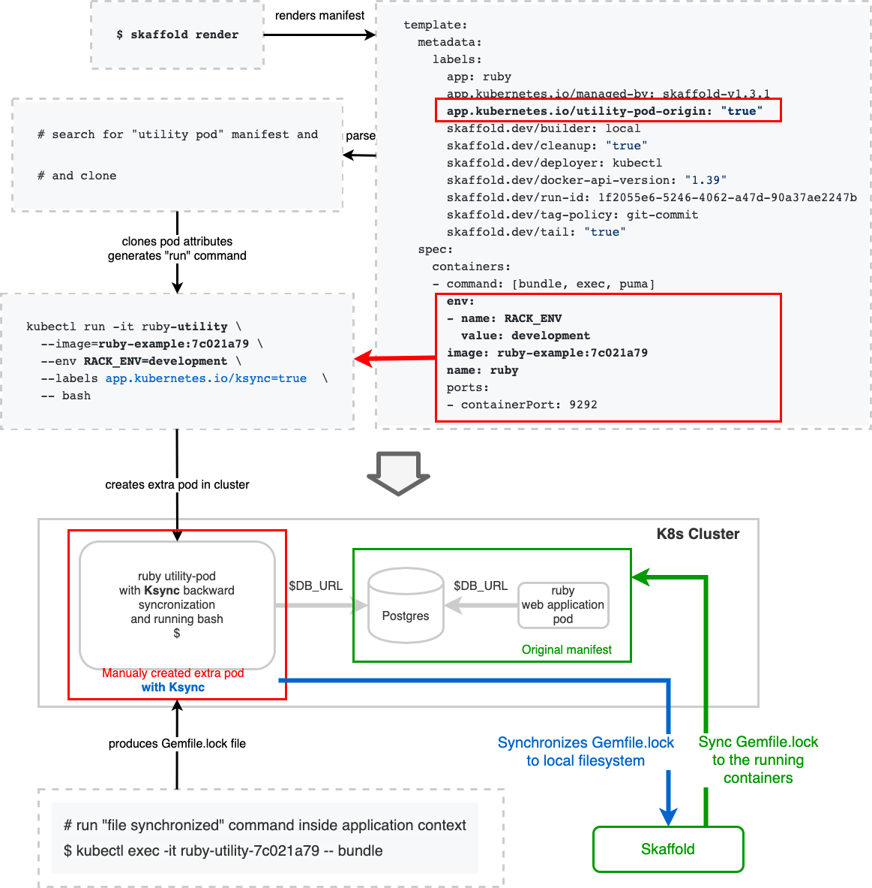

Here is the playground for doing "local" development of Ruby web application on top of Kubernetes:

.

Checkout source code:
```bash
git clone git@github.com:dsalahutdinov/kubedev-ruby.git
cd kubedev-ruby
```

Deploy application with Skaffold and simple k8s manifest:
```bash
# deploy the application to minikube (or to whatever)
$ skaffold run --port-forward --force=true --tail
```
Note, that as application now is not ready to run as web service, we [scale it to 0](https://github.com/dsalahutdinov/kubedev-ruby/blob/master/k8s/deployment.yaml#L19).

Set up ksync to synchronize files btw local `./backend` folder and the `/app` folder of the remote containers. Note, that we do it for containers with special label `app.kubernetes.io/ksync="true"`. Basic k8s manifest does not have this label set for pods.

```bash
# create synchronizing rule files btw local backend folder and /app in container (with special tag)
$ ksync create --selector app.kubernetes.io/ksync="true" --reload=false -n default $(pwd)/backend /app/

# start ksync
$ ksync watch --log-level=debug
```

# Idea of using "utility pod"

For local development, let's use the specific Kubernetes deployment, with we would call "utility". We will get the existing deployment manifest from `skaffold render`, extract all the config of target deployment and create our copy of pod (with the same env, docker image/tag) and run there bash.

Let see on example:

```bash
$ skaffold render

apiVersion: v1
kind: Service
metadata:
  labels:
    app.kubernetes.io/managed-by: skaffold-v1.3.1
    skaffold.dev/builder: local
    skaffold.dev/cleanup: "true"
    skaffold.dev/deployer: kubectl
    skaffold.dev/docker-api-version: "1.39"
    skaffold.dev/run-id: 1f2055e6-5246-4062-a47d-90a37ae2247b
    skaffold.dev/tag-policy: git-commit
    skaffold.dev/tail: "true"
  name: ruby
  namespace: default
spec:
  ports:
  - port: 9292
    targetPort: 9292
  selector:
    app: ruby
  type: LoadBalancer
---
apiVersion: apps/v1
kind: Deployment
metadata:
  labels:
    app.kubernetes.io/managed-by: skaffold-v1.3.1
    skaffold.dev/builder: local
    skaffold.dev/cleanup: "true"
    skaffold.dev/deployer: kubectl
    skaffold.dev/docker-api-version: "1.39"
    skaffold.dev/run-id: 1f2055e6-5246-4062-a47d-90a37ae2247b
    skaffold.dev/tag-policy: git-commit
    skaffold.dev/tail: "true"
  name: ruby
  namespace: default
spec:
  replicas: 0
  selector:
    matchLabels:
      app: ruby
  template:
    metadata:
      labels:
        app: ruby
        app.kubernetes.io/managed-by: skaffold-v1.3.1
        app.kubernetes.io/utility-pod-origin: "true"
        skaffold.dev/builder: local
        skaffold.dev/cleanup: "true"
        skaffold.dev/deployer: kubectl
        skaffold.dev/docker-api-version: "1.39"
        skaffold.dev/run-id: 1f2055e6-5246-4062-a47d-90a37ae2247b
        skaffold.dev/tag-policy: git-commit
        skaffold.dev/tail: "true"
    spec:
      containers:
      - command:
        - bundle
        - exec
        - puma
        env:
        - name: RACK_ENV
          value: development
        image: ruby-example:7c021a7953663fe79a7a0bb9f744dbefaec04a68050666885c16b1bccc710f7d
        name: ruby
        ports:
        - containerPort: 9292
```

We find the deployment with label `app.kubernetes.io/utility-pod-origin: "true"` and clone the whole deployment:
```bash
kubectl run -it ruby-utility \
  --image=ruby-example:7c021a7953663fe79a7a0bb9f744dbefaec04a68050666885c16b1bccc710f7d \
  --env RACK_ENV=development \
  --labels app.kubernetes.io/ksync=true  \
  -- bash
```
Also, add the `ksync=true` tag, to enable file sync 2 was file sync for this container.

Then, any changes made to local `Gemfile` will be synced with remote container.
To update dependencies I have to run `bundle` inside the utility pod by running:
```bash
kubectl exec -it ruby-console-69674c499f-xhgm8 -- bundle
```
This command updates the `Gemfile.lock` wich would be synchronized back to local machine.
When the utility pod is not longer needed, we can drop it out by running:
```bash
kubectl delete deployment ruby-utility
```

After that, I have to update the deployed application by running `skaffold delete/run`. It could be done automatically with continuous deployment mode `skaffold dev`.

There is draft ruby file [kubedev.rb](https://github.com/dsalahutdinov/kubedev-ruby/blob/master/kubedev.rb) for automation work with "utility" deployment/pod.
It could be used as follows:
```
$ ruby kubedev.rb bundle

["bundle"]
kubectl exec -it ruby-utility-566779-cx55z -- bundle
Using bundler 2.1.2
Using nio4r 2.5.2
Using puma 4.3.1
Using rack 2.2.2
Bundle complete! 2 Gemfile dependencies, 4 gems now installed.
Use `bundle info [gemname]` to see where a bundled gem is installed.
```


